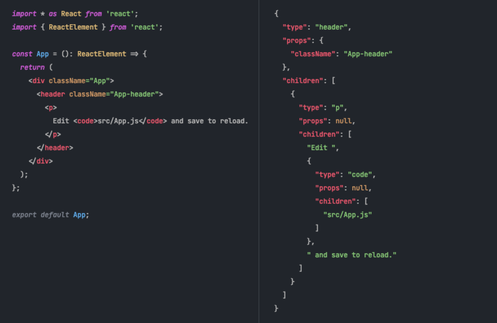

# convert-react-to-json

## Outline

Converts simple stateless React components to a JSON representation.

A typical use case might be where you need to define some tree in a CMS which are then rendered on a client using some pre-defined components




## Installation

```
yarn add "react-to-json"
```

## How to use

reactToJSON has two modes, switched with the option `expandDeep`

1. Simple renders your JSX to a JSON string almost verbatim without expanding all the components
2. Imports all components and expands them to their DOM primitives

So if you wish to deep render your App.tsx you might do something like

```typescript
const json = await reactToJSON("App.tsx", {expandDeep: true})
```

## Detailed Example

Say you want to convert the classic Create React App `App.tsx` to JSON:

```typescript
// App.tsx
import * as React from "react"
function App() {
  return (
    <div className="App">
    <header className="App-header">
      <p>
        Edit <code>src/App.js</code> and save to reload.
      </p>
      </header>
      </div>
  );
}

export default App; // <--- Note: you MUST have a default export
```

To do this call `reactToJSON` with the path to your file along with the props you wish to send to the default-export'd component and any compile options you may require:

```typescript
// compile.js
const { reactToJSON } = require("react-to-json")
const path = require("path")
const src = path.resolve(__dirname, './src/App.tsx');
(async () => {
  const output = await reactToJSON(
    src,
    {
      array: ['one', 'two'],
    },
    {
      prettyPrint: true,
    }
  );
  console.log(output)
})()
```

Then run in the cli like so

```
NODE_ENV=development node compile.js 
```

This would give the output

```json
{
  "type": "header",
  "props": {
    "className": "App-header"
  },
  "children": [
    {
      "type": "p",
      "props": null,
      "children": [
        "Edit ",
        {
          "type": "code",
          "props": null,
          "children": [
            "src/App.js"
          ]
        },
        " and save to reload."
      ]
    }
  ]
}
```

## Options

- `prettyPrint: Boolean`
  - Default `false`
  - Set to `true` if you want to pretty print the JSON output (i.e. with new lines and indenting. Defaults to `false`
- `babelConfig: TransformOptions`
  - The configuration object for the transform. If not set it uses the default version which is a fairly typical default for most React projects
- `expandDeep: Boolean`
  - Default `false`  
  - If set to `true`, the React tree is fully-expanded to primitives as var as it can go 
- `logBuildOutput: Boolean`
  - Outputs a log of the Rollup build

## Limitations

- Must define the path with a string as opposed to using, for instance, `require`
- You must import React in that file (even though in React 17.0 you don't need that)
- At least one of the files you are consuming needs to be TypeScript due to an issue with Rollup's TypeScript plugin I haven't figured out yet
- Only works with `export default` for now; no named exports
- Only works with DOM currently (probably)
- No error handling
